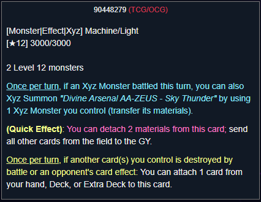
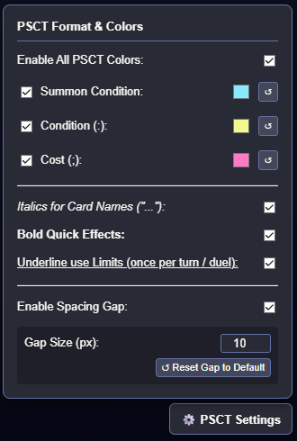

# DuelingNexus - PSCT Color Highlighter & Formatter

A feature-rich Tampermonkey userscript designed for **DuelingNexus** to enhance card text readability by automatically highlighting Problem-Solving Card Text (PSCT) elements, formatting card names, Quick Effects, use limits, and adding customizable spacing.

---

 

## Features

* **PSCT Color Highlighting:**
  * **Conditions (`:`):** Highlights activation conditions and timings.
  * **Costs (`;`):** Highlights activation costs.
  * **Summon Conditions:** Automatically detects and colors inherent summon conditions (strictly isolated from activated effects).
* **Card Text Formatting:**
  * **Card Names:** Italicizes text enclosed in quotation marks (`"..."`).
  * **Quick Effects:** Bolds `(Quick Effect)` and related quick effect terms.
  * **Use Limits:** Underlines restriction clauses (e.g., *"once per turn"*, *"twice per duel"*).
* **Custom Spacing Controls:** Adds clean spacing gaps between sentences and lines to prevent dense text blocks.
* **Fully Customizable UI:** Includes an in-game settings panel (`⚙️ PSCT Settings`) to toggle features on/off, customize highlight colors with real-time preview, adjust gap sizes, and reset to defaults.
* **Persistent Preferences:** Automatically saves all user configurations using browser `localStorage`.
* **Performance Optimized:** Features built-in DOM caching to prevent redundant processing during intense duels.

---

## Installation

To use this userscript, you need a browser extension that supports userscripts (such as **Tampermonkey**, **Violentmonkey**, or **Greasemonkey**).

1. Install a userscript manager extension for your browser:
   * [Tampermonkey for Chrome/Firefox/Edge](https://www.tampermonkey.net/)
2. **Install the Script:** Click on the link below to install the script directly through Tampermonkey:
   * [Install script.user.js](https://raw.githubusercontent.com/LiatDrazil/DuelingNexus-PSCT-Color-Highlight-and-Formatterer/main/script.user.js)
3. **Confirm Installation:** Tampermonkey will prompt you to confirm the installation. Click **Install**.

---

## Supported Pages

The script automatically runs on the following DuelingNexus paths:
* `https://duelingnexus.com/duel/*`
* `https://duelingnexus.com/replay/*`
* `https://duelingnexus.com/game/*`
* `https://duelingnexus.com/editor/*`

---

## Usage & Settings

Once installed, look for the **⚙️ PSCT Settings** floating button in the bottom-right corner of supported DuelingNexus pages. Click it to open the configuration panel where you can:
* Enable or disable master color formatting.
* Customize or toggle individual colors for Conditions, Costs, and Summon Conditions.
* Toggle formatting options for card names, quick effects, and usage limits.
* Enable or fine-tune line spacing sizes.
